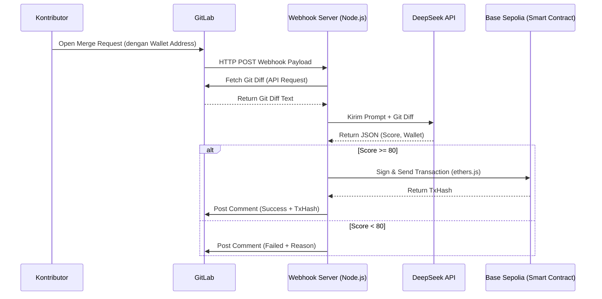
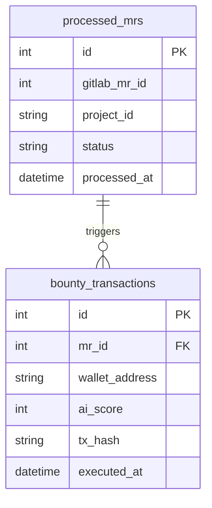

# PRD: Project Requirements Document

## 1. Overview

Sistem ini adalah agen _Software Development Life Cycle_ (SDLC) otonom yang dirancang untuk mempercepat proses peninjauan kode dan distribusi penghargaan (bounty) bagi kontributor sumber terbuka. Masalah utama yang diselesaikan adalah lambatnya proses peninjauan manual dan birokrasi pencairan dana untuk kontributor.

Tujuan utama sistem ini adalah menyediakan _server webhook_ berbasis Node.js yang bertindak sebagai jembatan antara GitLab, evaluator kecerdasan buatan, dan jaringan _blockchain_. Agen ini akan mengevaluasi setiap _Merge Request_ (MR), dan jika memenuhi standar kualitas, secara otonom memicu _smart contract_ untuk mengirimkan pembayaran langsung ke dompet kripto kontributor.

## 2. Requirements

Berikut adalah persyaratan tingkat tinggi untuk pengembangan sistem Proof of Concept (PoC) ini:

- **Aksesibilitas:** Sistem beroperasi sebagai layanan _backend_ (head-less) yang terus berjalan dan merespons HTTP POST _request_ dari GitLab Webhooks.
- **Pengguna:** Dioperasikan oleh Pemilik Repositori (Admin), berinteraksi secara pasif dengan Kontributor (Developer).
- **Data Input:** _Payload_ otomatis dari GitLab yang berisi detail MR dan _git diff_ (perubahan kode). Dompet target di-input oleh kontributor pada deskripsi MR.
- **Spesifisitas Data:** Evaluasi AI dibatasi secara ketat untuk hanya menghasilkan format JSON yang berisi skor numerik dan alamat _wallet_.
- **Notifikasi:** Peringatan keberhasilan atau kegagalan transaksi tidak dikirim via email, melainkan dipublikasikan langsung sebagai komentar otomatis pada _thread Merge Request_ di GitLab.

## 3. Core Features

Fitur-fitur kunci yang mengunci ruang lingkup MVP (Minimum Viable Product):

1. **GitLab Webhook Listener**
   - Endpoint tunggal (`/webhook/gitlab`) untuk menerima _event_ saat MR dibuat atau diperbarui.
   - Filter lapisan pertama untuk menolak _payload_ yang tidak relevan (menghemat komputasi).
2. **Context Extractor Engine**
   - Modul untuk memanggil GitLab API guna menarik teks _git diff_ mentah dari MR yang memicu _webhook_.
3. **Strict AI Evaluator**
   - Integrasi DeepSeek API untuk membaca _diff_ dan mengekstrak alamat dompet dari deskripsi MR.
   - Pemaksaan format _output_ JSON untuk mencegah halusinasi teks.
4. **Web3 Execution Layer**
   - Modul `ethers.js` yang menandatangani transaksi ke _smart contract_ di Base Sepolia Testnet.
   - Dilengkapi gerbang logika pembatasan (skor AI harus > 80 untuk memicu transaksi).
5. **Feedback Loop Auto-Commenter**
   - Modul untuk memposting hasil evaluasi, skor AI, dan tautan _TxHash blockchain_ kembali ke GitLab MR sebagai bukti kerja agen.

## 4. User Flow

Alur kerja ini mewakili interaksi tanpa sentuhan manusia sejak kode diunggah:

1. **Inisiasi:** Kontributor membuat _Merge Request_ di GitLab dan mencantumkan alamat _wallet_ EVM mereka di kotak deskripsi.
2. **Trigger:** GitLab mengirim _payload webhook_ ke _server_ Node.js agen.
3. **Ekstraksi:** Agen mengambil perubahan kode aktual dari MR tersebut menggunakan token akses GitLab.
4. **Evaluasi:** Agen mengirimkan kode ke DeepSeek API. Model memberikan penilaian dan mengembalikan skor beserta alamat _wallet_ dalam bentuk JSON.
5. **Eksekusi:** \* Jika skor di bawah batas standar: Agen melewati langkah pembayaran.
   - Jika skor memenuhi standar: Agen mengeksekusi fungsi `payBounty` pada _smart contract_ Testnet.
6. **Resolusi:** Agen memposting komentar di MR tersebut berisi ringkasan, skor, dan bukti transaksi.

## 5. Architecture

Berikut adalah aliran data asinkron dari sistem yang akan kamu bangun:

## 6. Database Schema

Meskipun ini adalah agen otonom, kamu memerlukan _database_ lokal ultra-ringan (SQLite) untuk mencatat status MR. Tanpa ini, peretas dapat memicu _webhook_ berulang kali pada MR yang sama untuk menguras dompet _bounty_.

| Tabel                   | Deskripsi                                                                                                                                 |
| ----------------------- | ----------------------------------------------------------------------------------------------------------------------------------------- |
| **processed_mrs**       | Mencatat ID Merge Request dari GitLab yang sudah dievaluasi untuk mencegah _double-spending_ atau evaluasi ganda yang membuang kuota API. |
| **bounty_transactions** | Menyimpan jejak audit finansial internal, mencatat skor, dompet tujuan, dan bukti kriptografis (_tx_hash_).                               |

## 7. Design & Technical Constraints

Sistem ini harus mematuhi batasan berikut untuk memastikan keandalan selama masa penjurian kompetisi:

1. **High-Level Technology:**
   - Backend murni menggunakan Node.js dan TypeScript untuk memastikan tipe data JSON dari GitLab dan AI tertangani dengan aman tanpa _runtime error_.
   - Eksekusi Web3 terkunci pada jaringan Base Sepolia menggunakan pustaka `ethers.js` v6.
   - _Smart contract_ Solidity harus memiliki pembatasan maksimal pencairan dana yang di-hardcode.

2. **Typography Rules (Jika menyediakan Dashboard Visual/Log Viewer):**
   Sistem antarmuka (UI) wajib menggunakan konfigurasi font variable sebagai berikut untuk menjaga konsistensi visual:
   - **Sans:** `Geist Mono, ui-monospace, monospace`
   - **Serif:** `serif`
   - **Mono:** `JetBrains Mono, monospace`
